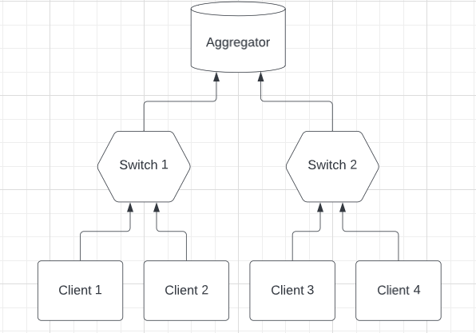

# The 277 project

In this repository we aim to benchmark the hinderance that Fully Homomorphic Encryption (FHE) introduces, impacting efficiency.

Our project simulates a Federated Learning Model (FL) with its topology as shown below.



There are three separate tests that we run:
1. [Base Case](#base-case) - This example will only transfer information in plaintext under our FL model.
2. [Base Case + FHE](#base-case-with-fhe) - This example will transfer information under FHE and do computation only in the aggregator node under our FL model.
3. [Base Case + FHE + In-Network Computing](#base-case-with-fhe-with-in-network-computing) - This example attempts to optimize and improve the efficiency of the process by introducing in-network computing, which offloads some of the computation to the middle switches in our FL model.

## Installation

Clone this GitHub repository

```sh
git clone https://github.com/edzhangsy/CS277.git
```

Change Directory into the folder

```sh
cd CS277
```

Make the setup file an executable and run
```sh
chmod +x setup.sh
./setup.sh
```
## Running FL Simulation
We combine the code for three roles in one repository.

Use the `python main.py agg` to start the server.

For other servers, just use the `python main.py` to start

> remember to start the server in background so it don't be killed when you disconnet you ssh.

The aggregator will read the `config.json` file.
Then it will call the other machines' `config` interface and send them their config.
The config for other clients are stored under the `others` dictionary.
The key is the IP address, The value is the config.
Send the config to the corresponding client.
After receiving the config, which is a json from the aggregator, the other servers will register the blueprint dynamically based on the `type` in the config.
Check the `config.json` file and add configs if needed.

The configs should be self-explained.

When the type if client, there are `client_number` and `index`.
Which indicates how many clients is used in this experiment, and current client's index.
This is useful to divide the training and testing data set.
For example, a client is index 0 among 4 clients, so he will slice the data set into 4 slices, and he operates on the index 0 of the slices.


When you want to start another experiment, just edit the `config.json`, restart the aggregator.

## Development

Because each kind of server have different kinds of interfaces, we separate them into different blueprints.
See the flask documentation for what is blueprint.
If you are developing the `client`, just edit the `client.py` and add interfaces.
The config that received from the server is stored in the `config` variable in `client.py` or `switch.py`
For example, if you are developing the client, the config that received from the server should be accessible in local `config` file.
If you want to send some data to the switch, just read the config, and get which address you should send to.
Then send to the interface of that address, for example, `http://10.10.1.5:5000/s/receive`.
Then, look at the status code!!
If it's 200, that is successful.
Look for the flask documentation for how to check the status code.
Also, you should write the log into the local `log` directory.
Just use some dictionary to store the logs.

For example, the log dictionary can be looked like this.

```
{
    "iteration": [
        {
            "start_time": "timestamp",
            "end_time": "timestamp",
            "byte_received": 50,
            "byte_send": 100
        },
        {
            "start_time": "timestamp",
            "end_time": "timestamp",
            "byte_received": 50,
            "byte_send": 100
        },
        {
            "start_time": "timestamp",
            "end_time": "timestamp",
            "byte_received": 50,
            "byte_send": 100
        }
    ]
}
```

I made this repo public
So, you can clone it anywhere you want.
I also add you guys the contributor on github.
When you want to make some changes, you develop somewhere, push it to github.
Then pull it in the cloudlab machines.

There are 15 machines on the cloudlab.
The 15 machines are connected physically using one switch.
And the address beginning with `10.10` is the local address.
The `node0` has address `10.10.1.1`.
The `node1` has address `10.10.1.2`
And so on.

For convenience, let's use the node14, `10.10.1.15` as the aggregator.

*Remember not to add unless files when you commit.*

*Remember to start the all the clients first, then start the aggregator*

*Maybe you should open the port 5000 using the iptables*

## PySEAL

Initially the PySEAL library was chosen for its ease of use being directly compatible with our setup written in Python.

>Note: Microsoft SEAL library does not come with working with Tensors directly.

Since PySEAL simply invokes a python wrapper to the [Microsoft SEAL](https://github.com/microsoft/SEAL) library, we will have to modify futher if we want to use it on Tensors.

Below are the directions for running PySEAL and for more information visit the [PySEAL](https://github.com/Lab41/PySEAL/tree/master) GitHub repository.

#### Installation

PySeal library should be compiled first.
After compilation, you can see the `seal.*.so`
Copy it under the directory of the this repo, and you should be able to use it by `import seal`

You can run the `seal.sh` to set it up.

The examples to use the seal is included in the `5_ckks_basics.py`.

Because the seal-python is using the pybind to bind the original c++ library, we are dealing with python objects wrapping the c++ objects.
It's useful to use the `dir()` function to look at what methods are available for use.
For example, after generating the `secret_key`, use the `dir(secret_key)` and we can find the `save`, `load` and `to_string` methods.

## TenSEAL

TanSEAL is a library built on top of the Microsoft SEAL library.

It introduces extra features such as `Dot Product` and `Tensors` that makes Machine Learning applications easy to invoke FHE.

For more information visit the [TenSEAL](https://github.com/OpenMined/TenSEAL/tree/main) GitHub repository

## ML Model Running on Pytorch

For our ML model, we took an existing Pytorch implementation of a basic 2-layer neural network training on the MNIST dataset.

We have made some modifications to the *mnist.py* file where it writes the weights and biases vectors into a json file allowing us to call SEAL and encrypt the training vectors directly with FHE.

When we complete our Federated Learning model, the client will call the *replace_weights_mnist.py* where it will load the averaged weights returned by the Aggregator and resume training.

## Base Case

Some content for Section 1.

## Base Case with FHE

Aggregator begins the process with calling `../mnist_model/ckks_init.py` file
- This file generates a context used in our FHE
- It holds the context with its secret key under the `private_context` variable
- It also creates a public version that removes the secret key under the `server_context` variable
    - This public key is then forwarded down the tree (to the switch and client nodes)

When Client receives the public context, it is ready to train the model and encrypt the parameters. The encryption process is done through calling the  `../mnist_model/ckks_weights_client1.py` file
- This file reads in the public context in `lines 7-16 `
- Then it encrypts the message in `lines 48-51`
- Finally it serializes the cuphertext and saves it under `../mnist_model/ckks/ckks_weights'{i}'.pkl`

When the Aggregator receives this ciphertext it will then call `../mnist_model/ckks_aggregate_fl.py` file
- In the case that the secret key context is saved, you can just use `lines 137-153` which thats the weight parameters in bytes to turn it back into tensors.
- THen Calculations are done on it and it will decrypt the ciphertext to plaintext and can be ready to forward the files back to the client for retraining
- Files are saved in `../mnist_model/aggregate/ckks_weights'{i}}'.json`
## Base Case with FHE with In-Network Computing

Some content for Section 3.