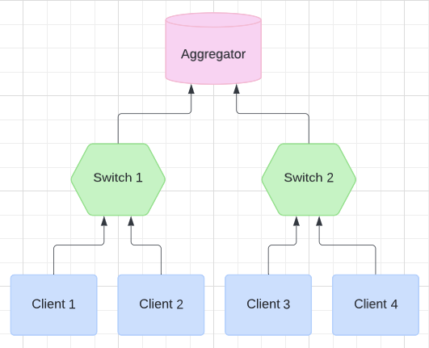

# The 277 project

In this repository we aim to benchmark the hinderance that Fully Homomorphic Encryption (FHE) introduces, impacting efficiency.

## Contents

- [Introduction](#introduction)
  <!-- - [Core Concepts](#core-concepts) -->
  <!-- - [Homomorphic Encryption](#homomorphic-encryption) -->
  - [Metrics](#metrics)
- [Running FL Simulation](#running-fl-simulation)
  - [Installation](#installation)
  - [Flask Setup](#flask-setup)
  - [Development](#development)
- [SEAL](#microsoft-seal)
  - [PySEAL](#pyseal)
    - [Installation](#installation-1)
  - [TenSEAL](#tenseal)
- [ML Model Running on Pytorch](#ml-model-running-on-pytorch)
- [Scenarios](#scenarios)
  - [Base Case](#base-case)
  - [Base Case + FHE](#base-case-with-fhe)
  - [Base Case + FHE + In-Network Processing](#base-case-with-fhe-with-in-network-processing)

## Introduction

Our project simulates a Federated Learning Model (FL) with its topology as shown below.

<center>



</center>

There are three separate tests that we run:
1. [Base Case](#base-case) - This example will only transfer information in plaintext under our FL model.
2. [Base Case + FHE](#base-case-with-fhe) - This example will transfer information under FHE and do computation only in the aggregator node under our FL model.
3. [Base Case + FHE + In-Network Processing](#base-case-with-fhe-with-in-network-processing) - This example attempts to optimize and improve the efficiency of the process by introducing in-network processing, which offloads some of the computation to the middle switches in our FL model.

We successfully implement our FL model with the use of 3 major libraries:
1. [Flask](https://flask.palletsprojects.com/en/3.0.x/) - A python web application framework that enables our servers to listen and transfer data. We modify the routes to simulate a FL model environment.
2. [TenSEAL](https://github.com/OpenMined/TenSEAL/tree/main) - A library that enables homomorphic encryption operations to be done on tensors. We leveraged this library to easily work with ML applications.
3. [Pytorch](https://pytorch.org) - A python framework that enables us to effortlessly implement ML models.

Acronym: **FL**[^1].\
Acronym: **FHE**[^2].

[^1]: Federated Learning

[^2]: Fully Homomorphic Excryption

### Metrics

The motivation for this project was based on wanting to understand how much applications would suffer when FHE is implemented in order to protect users privacy. 
We wanted to gain an understanding and see how feasible it is to take the tradeoff that FHE provides. 
For this reason, there are several metrics that we would like to investigate.

<center>

| Metric Name | Base | Base + FHE | Base + FHE + INP |
|:------------:|:-------:|:-------:|:-------:|
| Peak Memory (Gb)   | **<span style="color: red;">10</span>** | 20      | 15      |
| Process Time (s)    | 5                  | **<span style="color: blue; font-weight: bold;">8</span>**  | 12      |
| Max File Size (Gb)   | **<span style="color: green;">30</span>** | 25      | 40      |
| Time Saved (s)   | 30 | **<span style="color: cyan;">25</span>**      | 40      |

</center>

Acronym: **INP**[^3].

[^3]: In-Network Processing

## Running FL Simulation

In this section we will describe the needed requirements and interface setups for our FL model simulation.

### Installation

Clone this GitHub repository

```sh
git clone https://github.com/edzhangsy/CS277.git
```

Change Directory into the folder

```sh
cd CS277
```

Make the setup file an executable and run
```sh
chmod +x setup.sh
./setup.sh
```

### Flask Setup

We combine the code for three roles in one repository.

To run the cuurent setup, begin by starting the switch and client nodes
```sh
python main.oy
```

Run the aggregator node
```sh
python main.py agg
```

After open up the localhost webpage and change the url route to `/train`

> Note: Remember to start the server in background so it doesn't get killed when you disconnet your ssh.

The aggregator will first read the `config.json` file.
Then it will call the other machines' `config` interface and send them their config.
The config for other clients are stored under the `others` dictionary.
The key is the IP address, The value is the config.
Send the config to the corresponding client.
After receiving the config, which is a json from the aggregator, the other servers will register the blueprint dynamically based on the `type` in the config.
Check the `config.json` file and modify configs if needed.

The configs should be self-explainatory.

When the type is client, there is `client_number` and `index`.
Which indicates how many clients is used in this experiment, and current client's index.
This is useful to divide the training and testing data set.
For example, a client is index 0 among 4 clients, so he will slice the data set into 4 slices, and he operates on the index 0 of the slices.

When you want to start another experiment, just edit the `config.json` and restart the aggregator.

### Development

Because different types of servers have their corresponding unique interfaces, we separate them into different blueprints.
See the flask documentation for what is [blueprint](https://flask.palletsprojects.com/en/3.0.x/blueprints/).
If you are developing the `client`, just edit the `client.py` and add interfaces.
The config that is received from the server is stored in the `config` variable in `client.py` or `switch.py`
For example, if you are developing the client, the config that received from the server should be accessible in local `config` file.
If you want to send some data to the switch, just read the config, and get which address you should send to.
Then send to the interface of that address, for example, `http://10.10.1.5:5000/s/receive`.
Then, look at the status code!!
If it's 200, that is successful.
Look for the flask documentation for how to check the status code.
Also, you should write the log into the local `log` directory.
Just use some dictionary to store the logs.

For example, the log dictionary can look like this.

```json
{
    "iteration": [
        {
            "start_time": "timestamp",
            "end_time": "timestamp",
            "byte_received": 50,
            "byte_send": 100
        },
        {
            "start_time": "timestamp",
            "end_time": "timestamp",
            "byte_received": 50,
            "byte_send": 100
        },
        {
            "start_time": "timestamp",
            "end_time": "timestamp",
            "byte_received": 50,
            "byte_send": 100
        }
    ]
}
```

<!-- I made this repo public
So, you can clone it anywhere you want.
I also add you guys the contributor on github.
When you want to make some changes, you develop somewhere, push it to github.
Then pull it in the cloudlab machines. -->

There are 15 machines on the cloudlab.
The 15 machines are connected physically using one switch.
And the address beginning with `10.10` is the local address.
The `node0` has address `10.10.1.1`.
The `node1` has address `10.10.1.2`.
So on and so forth.

For convenience, let's use the node14, `10.10.1.15` as the aggregator.

*Remember not to add unless files when you commit.*

*Remember to start the all the clients first, then start the aggregator*

*Maybe you should open the port 5000 using the iptables*

## Microsoft SEAL

SEAL is an open source homomorphic encryption library developed by the Cryptography and Privacy Research Group at Microsoft.

For more information, visit the [Microsoft SEAL](https://github.com/microsoft/SEAL) GitHub repository.

### PySEAL

Initially the PySEAL library was chosen for its ease of use being directly compatible with our setup written in Python.

> Note: Microsoft SEAL library does not work with Tensors out of the box.

Since PySEAL simply invokes a python wrapper to the [Microsoft SEAL](https://github.com/microsoft/SEAL) library, we will have to modify futher if we want to use it on Tensors.

Below are the directions for running PySEAL and for more information, visit the [PySEAL](https://github.com/Lab41/PySEAL/tree/master) GitHub repository.

#### Installation

PySeal library should be compiled first.
After compilation, you can see the `seal.*.so`
Copy it under the directory of the this repo, and you should be able to use it by `import seal`

You can run the `seal.sh` to set it up.

The examples to use the seal is included in the `5_ckks_basics.py`.

Because the seal-python is using the pybind to bind the original c++ library, we are dealing with python objects wrapping the c++ objects.
It's useful to use the `dir()` function to look at what methods are available for use.
For example, after generating the `secret_key`, use the `dir(secret_key)` and we can find the `save`, `load` and `to_string` methods.

### TenSEAL

TanSEAL is a library built on top of the Microsoft SEAL library.

It introduces extra features such as `Dot Product` and `Tensors` that makes Machine Learning applications easy to invoke FHE.

The examples to use the seal is included in the `tenseal_ckks.py`.

For more information, visit the [TenSEAL](https://github.com/OpenMined/TenSEAL/tree/main) GitHub repository.

## ML Model Running on Pytorch

For our ML model, we took an existing Pytorch implementation of a basic 2-layer neural network training on the [MNIST dataset](https://git-disl.github.io/GTDLBench/datasets/mnist_datasets/).

We have made some modifications to the `mnist.py` file where it writes the weights and biases vectors into a json file allowing us to then call TenSEAL and encrypt the training tensors directly with FHE.

When we complete our Federated Learning model, the client will call the `replace_weights_mnist.py` where it will load the averaged weights returned by the Aggregator and resume training.

## Scenarios

In this section we will describe in more detail the the simulation logic for each scenario.

### Base Case

For the Base Case, the `Client Nodes` will begin by training its ML models locally. 
Then after some training iterations, the client will send its parameters up to the `Aggregator Nodes`. 
In this scenario, our `Switch Nodes` will act as dumb switches that simply forward the files as they come up to the `Aggregator Nodes`.

Once the `Aggregator Node` receives all the necessary files it will aggregate, average them, then send the new set of files back to all `Client Nodes`.

Finally, once the `Client Nodes` receives the files back from the `Aggregator Node`, it will updates its values in the ML model and continue training through a warmstart.

### Base Case with FHE

For the Base Case with FHE, the `Client Nodes` will begin by training its ML models locally. 
Then after completing its training, the client will encrypt the parameters and send it as a ciphertext up to the `Aggregator Nodes`. 
In this scenario, our `Switch Nodes` will act as dumb switches that simply forward the files as they come up to the `Aggregator Nodes`.

Once the `Aggregator Node` receives all the necessary files it will aggregate, average them, then decrypt the ciphertext back to plaintext before sending the new set of files back to all `Client Nodes`.

Finally, once the `Client Nodes` receives the files back from the `Aggregator Node`, it will updates its values in the ML model and continue training through a warmstart.

<!-- Aggregator begins the process with calling `../mnist_model/ckks_init.py` file
- This file generates a context used in our FHE
- It holds the context with its secret key under the `private_context` variable
- It also creates a public version that removes the secret key under the `server_context` variable
    - This public key is then forwarded down the tree (to the switch and client nodes)

When Client receives the public context, it is ready to train the model and encrypt the parameters. The encryption process is done through calling the  `../mnist_model/ckks_weights_client1.py` file
- This file reads in the public context in `lines 7-16 `
- Then it encrypts the message in `lines 48-51`
- Finally it serializes the cuphertext and saves it under `../mnist_model/ckks/ckks_weights'{i}'.pkl`

When the Aggregator receives this ciphertext it will then call `../mnist_model/ckks_aggregate_fl.py` file
- In the case that the secret key context is saved, you can just use `lines 137-153` which thats the weight parameters in bytes to turn it back into tensors.
- THen Calculations are done on it and it will decrypt the ciphertext to plaintext and can be ready to forward the files back to the client for retraining
- Files are saved in `../mnist_model/aggregate/ckks_weights'{i}}'.json` -->

### Base Case with FHE with In-Network Processing

For the Base Case with FHE with In-Network Processing, the `Client Nodes` will begin by training its ML models locally. 
Then after completing its training, the client will encrypt the parameters and send it as a ciphertext up to the `Aggregator Nodes`. 
In this scenario, our `Switch Nodes` will help decrease the load for the aggregator and perform local aggregation combining two files into one before forwarding the files up to the `Aggregator Nodes`.

Once the `Aggregator Node` receives all the necessary files it will aggregate the remaining files, average them, then decrypt the ciphertext back to plaintext before sending the new set of files back to all `Client Nodes`.

Finally, once the `Client Nodes` receives the files back from the `Aggregator Node`, it will updates its values in the ML model and continue training through a warmstart.
